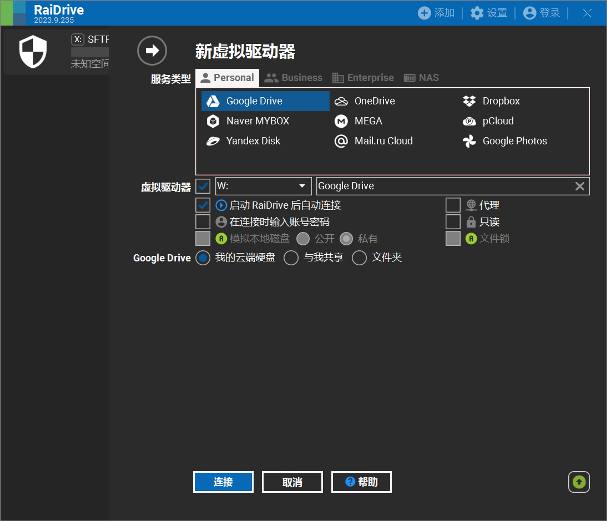
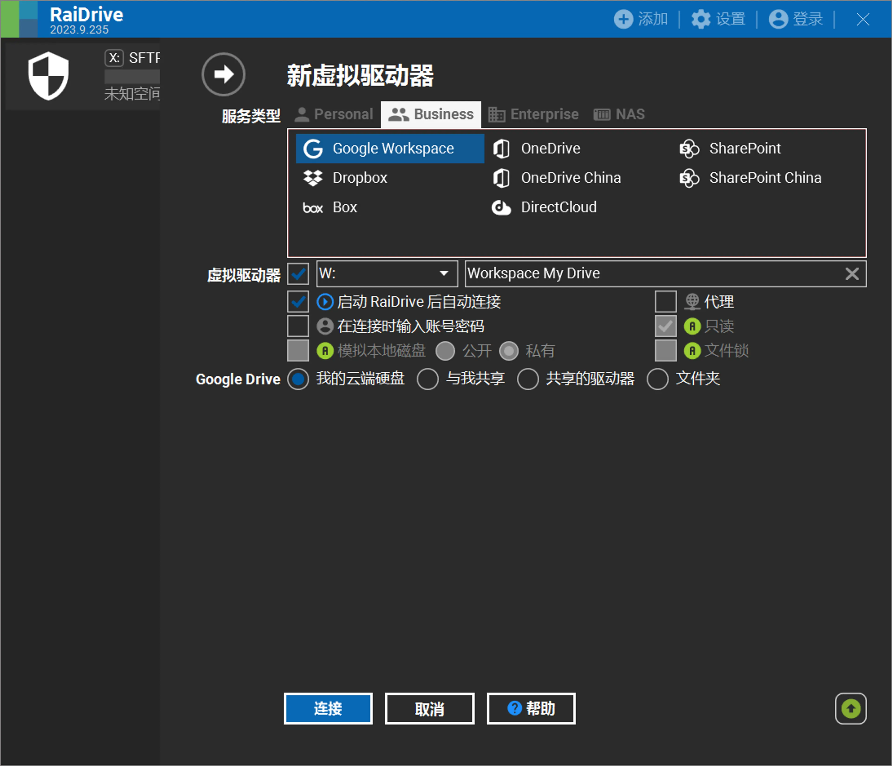
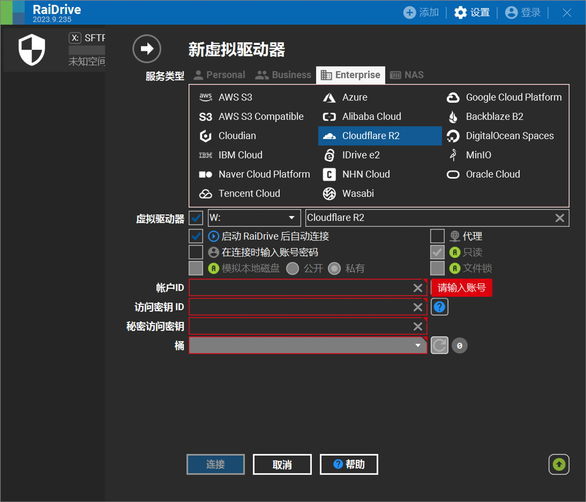
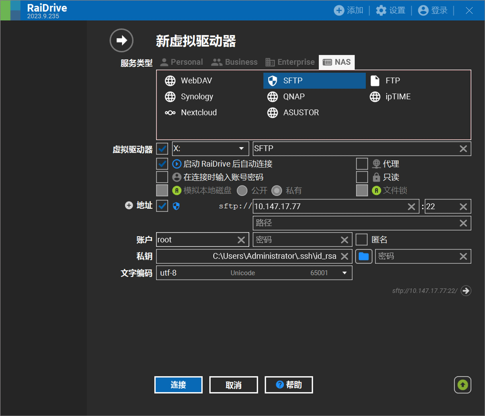
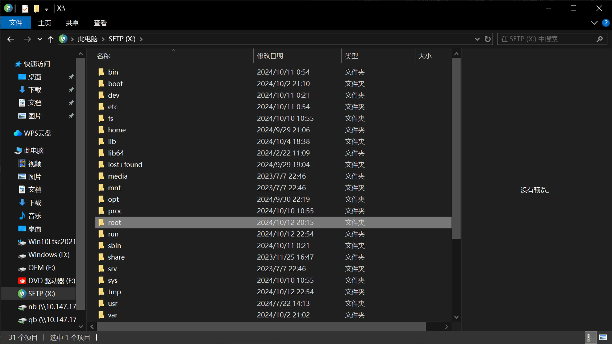
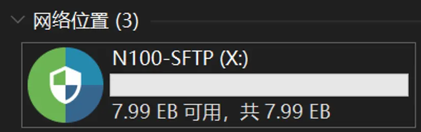

> [!WARNING]
> 此软件具有广告

##### 前几天，我推荐使用SSHFS来将Linux的目录挂载为本地磁盘方便访问，今天，我又发现一个神级软件：[RaiDrive](https://www.raidrive.com)

---

### 简介

RaiDrive GUI支持Win，CLI支持Linux，并且界面引导友好
[RaiDrive下载页](https://www.raidrive.com/download)

支持Google Drive、OneDrive、AWS S3 对象存储、Cloudflare R2 对象存储、阿里云、谷歌云、腾讯云、甲骨文云、WebDAV、SFTP、FTP等**42种服务和协议**

### 例图

### 容量获取不准，但是不妨碍它牛逼😋

### 疑难解答

1. 软件正常运行需要**NET. 6.0**和**Microsoft Edge WebView2**。安装程序会尝试进行修复，如果失败请手动下载
2. 该软件可以挂载一些无法被Windows原生WebDAV挂载（映射到网络驱动器）的服务
